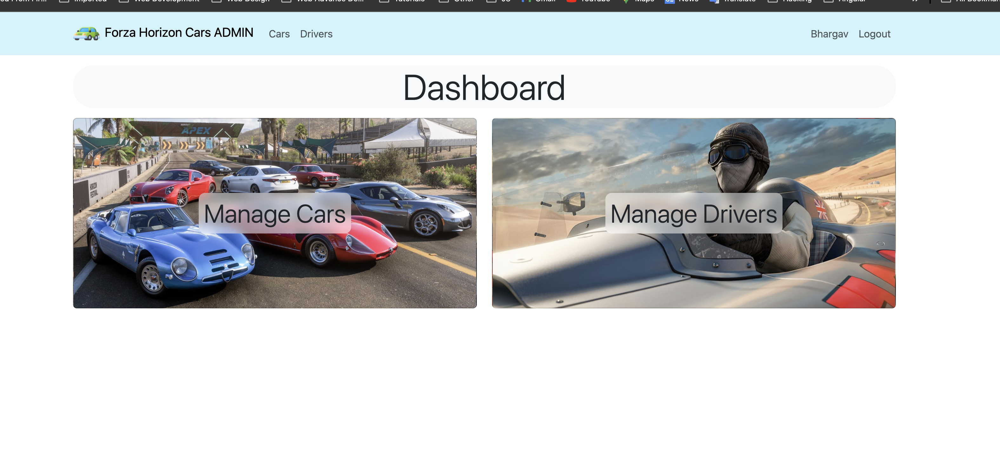

## Project Overview

ForzaCars CMS is a Content Management System specifically tailored for showcasing and managing forza game cars related content. It is built using PHP and MySQL and is designed to allow easy management of car listings and other related data. The system includes both a backend management dashboard and a frontend website that displays content pulled from the CMS. Additionally, it includes an admin dashboard that allows for easy management of user accounts, car listings, and other related data.

## Features

- Car Listings Management: Add, edit, and delete car listings with details such as images, specifications, and pricing.
- Added 2 CRUD modules - cars and driver
- Driver has one car id that saves the relation in each table.
- Authentication to add/update/delete cars and drivers

## Database schema 

In the ForzaCars project, two models define two key entities in a racing application: Car and Driver. The Car model captures detailed attributes about a vehicle, including its image, name, model type, in-game price, drive type, speed, handling, acceleration, horsepower, weight, associated video ID, and car sound. The model supports soft deletion, allowing records to be marked as deleted without being permanently removed, which is useful for recovery or audit purposes. The fillable array ensures that only specific attributes can be mass-assigned, enhancing security.

The Driver model represents a racing driver with attributes like first name, last name, age, country, years of experience, and team affiliation. The Driver model also supports soft deletion and includes a one-to-one relationship with the Car model, indicating that each driver is assigned a specific car. The driver_id serves as the primary key for this model, and the relationship is defined using the car_id foreign key, linking each driver to their corresponding car.

Together, these models define a clear structure where each driver is associated with one car, and both entities have the flexibility to be soft-deleted, ensuring data integrity and allowing for future recovery if necessary. The schema is designed to handle racing data efficiently, supporting key features like soft deletion and secure mass-assignment.

## Laravel Project Setup Guide

Here are the steps to clone a Laravel project, build it, and run it locally:

1. **Clone the Repository**:

    - Open your terminal or command prompt.
    - Navigate to the directory where you want to store the project.
    - Use the `git clone` command followed by the repository URL:
        ```bash
        git clone <repository-url>
        ```
    - Replace `<repository-url>` with the URL of the GitHub repository.

2. **Navigate to the Project Directory**:

    ```bash
    cd <project-name>
    ```

    - Replace `<project-name>` with the name of your project directory.

3. **Install Dependencies**:

    - Make sure you have [Composer](https://getcomposer.org/) installed.
    - Run the following command to install PHP dependencies:
        ```bash
        composer install
        ```
    - If your project uses Node.js, install Node dependencies:
        ```bash
        npm install
        ```

4. **Set Up Environment Variables**:

    - Copy the `.env.example` file to `.env`:
        ```bash
        cp .env.example .env
        ```
    - Open the `.env` file and configure your database and other settings.

Change the values in the `.env` file to match your database configuration.

```bash
    DB_CONNECTION=mysql
    DB_HOST=127.0.0.1
    DB_PORT=3306
    DB_DATABASE=forzacars
    DB_USERNAME=your_username
    DB_PASSWORD=your_password
```

5. **Generate Application Key**:

    ```bash
    php artisan key:generate
    ```

6. **Run Migrations** (if your project uses a database):

    ```bash
    php artisan migrate:refresh
    ```

7. **Install Frontend Dependencies**

    ```bash
    npm install
    ```

8. **Build Frontend**:

    ```bash
    npm run build
    ```

9. **Start the Development Server**:

    ```bash
    npm run dev
    ```

10. **Clear Cache**

    ```bash
    php artisan config:clear
    php artisan cache:clear
    ```

11. **Start the Development Server**:
    ```bash
    php artisan serve
    ```
    - This will start the server at `http://localhost:8000`.

# Web App Demo

Welcome to the demo of our web application. Below are some screenshots showcasing various features and functionalities.

## Register Page


## Login Page


## Forgot Password Page


## Verify Email Page


## Home Page - Cars Page Listing


## Drivers Page


## Admin Dashboard


